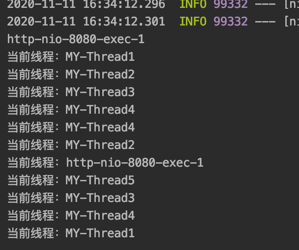

# 在接口中使用线程池，处理数据

## 1. 实例步骤

1. 定义线程池

   ```java
   package com.zszdevelop.threadpooldemo.config;
   
   
   import org.springframework.context.annotation.Bean;
   import org.springframework.context.annotation.Configuration;
   import org.springframework.scheduling.annotation.EnableAsync;
   import org.springframework.scheduling.concurrent.ThreadPoolTaskExecutor;
   
   import java.util.concurrent.ThreadPoolExecutor;
   
   @Configuration
   public class ThreadPoolConfigure {
   
       @Bean
       public ThreadPoolTaskExecutor asyncThreadPoolTaskExecutor() {
           ThreadPoolTaskExecutor executor = new ThreadPoolTaskExecutor();
           executor.setCorePoolSize(5);
           executor.setMaxPoolSize(10);
           executor.setQueueCapacity(50);
           executor.setKeepAliveSeconds(30);
           executor.setThreadNamePrefix("MY-Thread");
           executor.setWaitForTasksToCompleteOnShutdown(true);
           executor.setAwaitTerminationSeconds(60);
           executor.setRejectedExecutionHandler(new ThreadPoolExecutor.CallerRunsPolicy());
           executor.initialize();
           return executor;
       }
   
   }
   
   ```

2. 定义接口

   ```java
   package com.zszdevelop.threadpooldemo.controller;
   
   import com.zszdevelop.threadpooldemo.service.AsyncService;
   import org.springframework.beans.factory.annotation.Autowired;
   import org.springframework.web.bind.annotation.GetMapping;
   import org.springframework.web.bind.annotation.RestController;
   
   @RestController
   public class AsyncController {
   
       @Autowired
       AsyncService asyncService;
   
   
       @GetMapping("/testAsync")
       public String testAsync()
       {
           System.out.println(Thread.currentThread().getName());
           asyncService.useAsyncThreadWork();
           return "testAsync方法执行成功...";
       }
   }
   
   
   ```

3. 定义service

   ```java
   public interface AsyncService {
   
       /**
        * 测试使用异步线程池来执行工作
        */
       public void useAsyncThreadWork();
   
   }
   
   ```

4. 定义接口实现类

   ```java
   package com.zszdevelop.threadpooldemo.service.impl;
   
   
   import com.zszdevelop.threadpooldemo.service.AsyncService;
   import org.springframework.beans.factory.annotation.Autowired;
   import org.springframework.scheduling.annotation.Async;
   import org.springframework.scheduling.concurrent.ThreadPoolTaskExecutor;
   import org.springframework.stereotype.Service;
   
   import java.util.List;
   import java.util.concurrent.Executor;
   
   
   @Service
   public class AsyncServiceImp implements AsyncService {
   
       @Autowired
       ThreadPoolTaskExecutor threadPoolTaskExecutor;
   
       @Override
       public void useAsyncThreadWork() {
           for (int i = 0;i<10;i++){
               TestRunnable testRunnable = new TestRunnable();
               threadPoolTaskExecutor.submit(testRunnable);
           }
   
           System.out.println("当前线程："+Thread.currentThread().getName());
   
       }
   
   
       class TestRunnable implements Runnable {
   
   
           TestRunnable()  {
   
           }
   
   
   
           @Override
           public void run() {
               try {
                   // 执行你要的操作
                   System.out.println("当前线程："+Thread.currentThread().getName());
               } catch (Exception e) {
                   e.printStackTrace();
               }
   
           }
   
       }
   }
   
   ```

## 2. 测试

访问：http://localhost:8080/testAsync



## 3. 注意事项

### 3.1 子线程异常并不会直接抛出异常日志

子线程异常并不会直接抛出异常日志，需要自己在子线程中手动try catch

