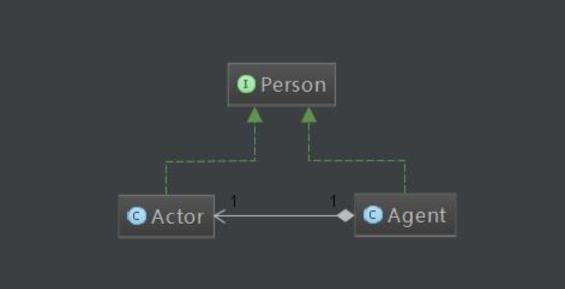

# Spring AOP实现原理

## 1. 代理模式

代理模式UML 类图如下



>类图中虚线箭头表示接口实现
>
>菱形和箭头表示组合
>
>具体参考[uml类图](cs/uml/README.md)

代理类实现了被代理类的接口，同时与被代理类是组合关系。下面看一下代理模式的实现

## 2. 静态代理

接口类：

```
interface Person {
    void speak();
}
```

真实实体类：

```
class Actor implements Person {
    private String content;
    public Actor(String content) {
        this.content = content;
    }

    @Override
    public void speak() {
        System.out.println(this.content);
    }
}
```

代理类：

```
class Agent implements Person {
    private Actor actor;
    private String before;
    private String after;
    public Agent(Actor actor, String before, String after) {
        this.actor = actor;
        this.before = before;
        this.after = after;
    }
    @Override
    public void speak() {
        //before speak
        System.out.println("Before actor speak, Agent say: " + before);
        //real speak
        this.actor.speak();
        //after speak
        System.out.println("After actor speak, Agent say: " + after);
    }
}
```

测试方法:

```
public class StaticProxy {
    public static void main(String[] args) {
        Actor actor = new Actor("I am a famous actor!");
        Agent agent = new Agent(actor, "Hello I am an agent.", "That's all!");
        agent.speak();
    }
}
```

结果：


## 3.动态代理

### 3.1 JDK自带方法

#### 3.1.1 InvocationHandler接口

InvocationHandler接口是最核心的接口

```
public interface InvocationHandler {
    public Object invoke(Object proxy, Method method, Object[] args)
        throws Throwable;
}
```

我们对于被代理的类的操作都会由该接口中的invoke方法实现，其中的参数的含义分别是：

- proxy：被代理的类的实例
- method：调用被代理的类的方法
- args：该方法需要的参数

**使用方法**

使用方法首先是需要实现该接口，并且我们可以在invoke方法中调用被代理类的方法并获得返回值，自然也可以在调用该方法的前后去做一些额外的事情，从而实现动态代理

#### 3.1.2 Proxy类的newProxyInstance方法

```
public static Object newProxyInstance(ClassLoader loader,
                                      Class<?>[] interfaces,
                                      InvocationHandler h)
    throws IllegalArgumentException
```

其中的参数含义如下：

- loader：被代理的类的类加载器
- interfaces：被代理类的接口数组
- invocationHandler：就是刚刚介绍的调用处理器类的对象实例

该方法会返回一个被修改过的类的实例，从而可以自由的调用该实例的方法。下面是一个实际例子。

#### 3.1.3 JDK自动代理实际例子

Fruit接口：

```
public interface Fruit {
    public void show();
}
```

Apple实现Fruit接口：

```
public class Apple implements Fruit{
    @Override
    public void show() {
        System.out.println("<<<<show method is invoked");
    }
}
```

代理类Agent.java：

```
public class DynamicAgent {

    //实现InvocationHandler接口，并且可以初始化被代理类的对象
    static class MyHandler implements InvocationHandler {
        private Object proxy;
        public MyHandler(Object proxy) {
            this.proxy = proxy;
        }
            
        //自定义invoke方法
        @Override
        public Object invoke(Object proxy, Method method, Object[] args) throws Throwable {
            System.out.println(">>>>before invoking");
            //真正调用方法的地方
            Object ret = method.invoke(this.proxy, args);
            System.out.println(">>>>after invoking");
            return ret;
        }
    }

    //返回一个被修改过的对象
    public static Object agent(Class interfaceClazz, Object proxy) {
        return Proxy.newProxyInstance(interfaceClazz.getClassLoader(), new Class[]{interfaceClazz},
                new MyHandler(proxy));
    }    
}
```

测试类：

```
public class ReflectTest {
    public static void main(String[] args) throws InvocationTargetException, IllegalAccessException {
        //注意一定要返回接口，不能返回实现类否则会报错
        Fruit fruit = (Fruit) DynamicAgent.agent(Fruit.class, new Apple());
        fruit.show();
    }
}
```

结果：


可以看到对于不同的实现类来说，可以用同一个动态代理类来进行代理，实现了“一次编写到处代理”的效果。但是这种方法有个缺点，就是被代理的类一定要是实现了某个接口的，这很大程度限制了本方法的使用场景。下面还有另外一个使用了CGlib增强库的方法。

### 3.2 CGLIB 库的方法

[CGlib](https://github.com/cglib/cglib)是一个字节码增强库，为AOP等提供了底层支持。下面看看它是怎么实现动态代理的。

```java
import com.zszdevelop.aopdemo.case2.Apple;
import org.springframework.cglib.proxy.Enhancer;
import org.springframework.cglib.proxy.MethodInterceptor;
import org.springframework.cglib.proxy.MethodProxy;

import java.lang.reflect.Method;

/**
 * @author zhangshengzhong
 * @date 2019/10/11
 */
public class CGlibAgent implements MethodInterceptor {

    private Object proxy;

    public Object getInstance(Object proxy) {
        this.proxy = proxy;
        Enhancer enhancer = new Enhancer();
        enhancer.setSuperclass(this.proxy.getClass());
        // 回调方法
        enhancer.setCallback(this);
        // 创建代理对象
        return enhancer.create();
    }
    //回调方法
    @Override
    public Object intercept(Object o, Method method, Object[] objects, MethodProxy methodProxy) throws Throwable {
        System.out.println(">>>>before invoking");
        //真正调用
        Object ret = methodProxy.invokeSuper(o, objects);
        System.out.println(">>>>after invoking");
        return ret;
    }

    public static void main(String[] args) {
        CGlibAgent cGlibAgent = new CGlibAgent();
        Apple apple = (Apple) cGlibAgent.getInstance(new Apple());
        apple.show();
    }
}
```


可以看到结果和JDK动态代理是一样的，但是可以直接对实现类进行操作而非接口，这样会有很大的便利。

### 参考文章

[Spring AOP实现原理](<https://www.cnblogs.com/puyangsky/p/6218925.html>)spring/aop/SpringAOP实现原理.md